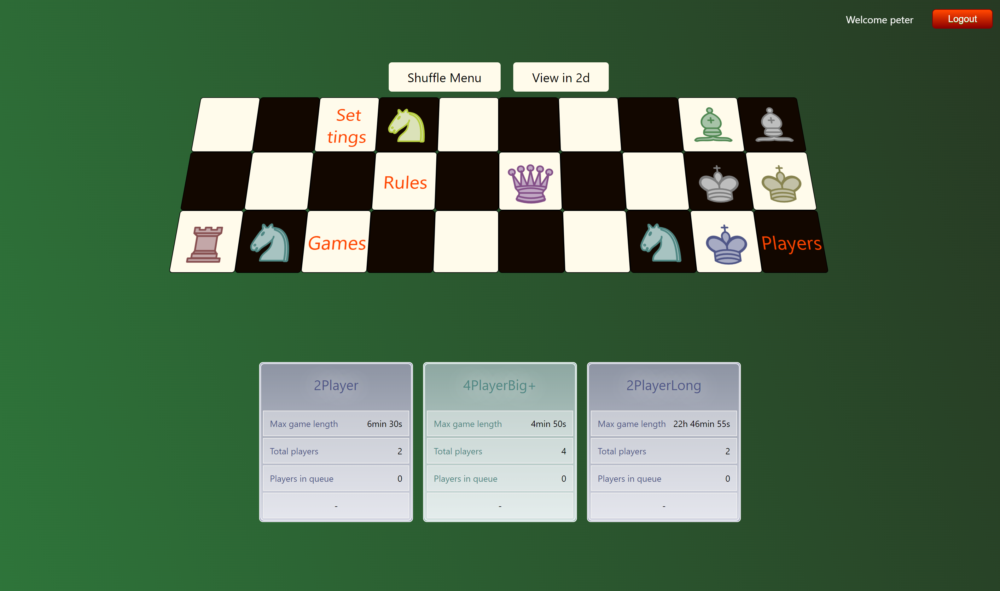

# Battle Royale Chess
## Chess, but better

Battle Royale Chess is a game designed to take chess to the next level. It features chess piece movement but with some additional rules on an ever decreasing gameboard size. Pieces will need to move to the middle to survive and the last King standing takes the win!




## Prerequisites

- NodeJS
- PostgreSQL
- IntelliJ

## Installation

##### Frontend

- Battle Royale Chess requires NodeJS to run.
- The frontend will run on [localhost:3000]
- Make sure the backend runs as well as an instance of postgreSQL.
- Installation for the backend is written below.

```sh
    npm install                 // to install npm packages
    npm start                   // to start the development server
```


##### Backend

- The backend will run on [localhost:8080]
- The backend requires an active postgreSQL server to run
- The postgreSQL server url, username and password should match the specified url, username and password in the application.properties file
- De database name should match 'battleroyalechess'
- On every run the database tables are dropped and recreated with fresh data. This behaviour can be changed to not dropping and recreating by setting spring.profiles.active to production in the application.properties file. spring.profiles.active=development recreates the tables on every run
- This fresh data comes from the 'Populate' files in the config folder

```sh
    to run the backend, open IntelliJ, load the project and press 'run'
```


## Credentials

The following credentials can be used to log in to Battle Royale Chess frontend
| Username | Password |  Role  |
| ------ | ------ | ------ |
| admin | password1 | admin |
| peter | password1 | user |
| bart | password1 | user |
| robin | password1 | user |
| laurens | password1 | user |
| maaike | password1 | user |


## API endpoints

### /admin

| Endpoint | Method | Protected | Role | Example Body | Description |
| ------ | ------ | ------ | ------ | ------ | ------ |
| /users | GET | yes | ADMIN | - | Shows a list of all the registered users of the application |
| /user/{username} | DEL | yes | ADMIN | - | Delete a user |
| /user/{username} | GET | yes | ADMIN | - | Get userdata of a specific user |
| /user/{username} | POST | yes | ADMIN | { "username":"peter3", "password":"password1", "email":"peter3@email.com", "authorities":["ADMIN"], "chessCom":"peter" } | Create a new user |
| /gametype | PUT | yes | ADMIN | {"gametype":"testgame", "numberOfPlayers":2, "circleShrinkAfterNRounds":10, "circleShrinkOffset":20, "timePerRound":20, "initialDelay":30, "board":{"1:1":["normal", "1", "King"],"1:2":["normal"],"1:3":["normal", "2", "King"]}, "playerDirections":["east", "west"]} | Update a gametype |
| /gametype | POST | yes | ADMIN | {"gametype":"testgame", "numberOfPlayers":2, "circleShrinkAfterNRounds":10, "circleShrinkOffset":20, "timePerRound":20, "initialDelay":30, "board":{"1:1":["normal", "1", "King"],"1:2":["normal"],"1:3":["normal", "2", "King"]}, "playerDirections":["east", "west"]} | Create a gametype |
| /gametype/{gametype} | DEL | yes | ADMIN | - | Delete a gametype |

### /games

| Endpoint | Method | Protected | Role | Example Body | Description |
| ------ | ------ | ------ | ------ | ------ | ------ |
| / | GET | no | SPECTATOR, USER, ADMIN | - | Get a list of all finished and unfinished games |
| /getGameIdForPlayer/{username} | GET | no | SPECTATOR, USER, ADMIN | - | Get a gameId for the game the current player is playing in |
| /{gameId} | GET | no | SPECTATOR, USER, ADMIN | - | Get gamedata for the specified gameId |
| /{gameId}/newMove | POST | yes | USER, ADMIN | { "from":"1:3", "to":"1:4" } | A player can post a move. Only for himself and only when he is in a game |
| /{gameId}/cancelMove | GET | yes | USER, ADMIN | - | A player can cencel his move

### /gametypes

| Endpoint | Method | Protected | Role | Example Body | Description |
| ------ | ------ | ------ | ------ | ------ | ------ |
| / | GET | no | SPECTATOR, USER, ADMIN | - | Get all available gametypes |

### /lobby

| Endpoint | Method | Protected | Role | Example Body | Description |
| ------ | ------ | ------ | ------ | ------ | ------ |
| /queue | GET | yes | USER, ADMIN | - | Get the full queue with queued players |
| /queue/{gametype} | GET | yes | USER, ADMIN | - | Place yourself in queue for specified gametype |
| /queue/ | DEL | yes | USER, ADMIN | - | Remove yourself from the queue you are in |

### /players

| Endpoint | Method | Protected | Role | Example Body | Description |
| ------ | ------ | ------ | ------ | ------ | ------ |
| / | GET | no | SPECTATOR, USER, ADMIN | - | Get a list with all players and their scores. No sensitive data |

### /register

| Endpoint | Method | Protected | Role | Example Body | Description |
| ------ | ------ | ------ | ------ | ------ | ------ |
| / | POST | no | SPECTATOR, USER, ADMIN | { "username":"peter2", "password":"password1", "email":"peter2@email.com", "authorities":["USER"], "chessCom":"peter" } | Register yourself as a user |

### /users

| Endpoint | Method | Protected | Role | Example Body | Description |
| ------ | ------ | ------ | ------ | ------ | ------ |
| / | GET | yes | USER, ADMIN | - | Get your own userdata |
| / | PUT | yes | USER, ADMIN | { "username":"admin", "password":"password2", "email":"admin2@email.com", "authorities":["ADMIN"], "chessCom":"admin" } | Update your own userdata |
| /{username} | DEL | yes | USER, ADMIN | - | Delete your own userdata |


## NPM commandos

The following table contains some npm commandos and their actions
| Name | Commando | Action |
| ------ | ------ | ------ |
| start | `react-scripts start` | Start an instance of the delopment server to view the application in the browser
| build | `react-scripts build` | Build the application to the build folder to host on a production server
| test | `npx jest` | Run unit tests with Jest
| test:watch | `npx jest --watch` | Automatically run unit tests on every file change
| eject | `react-scripts eject` | Eject will copy all dependencies and configuration files into the project. It can be used to edit the current react configuration. This is a one way operation.

[localhost:3000]: <http://localhost:3000>
[localhost:8080]: <http://localhost:8080>
